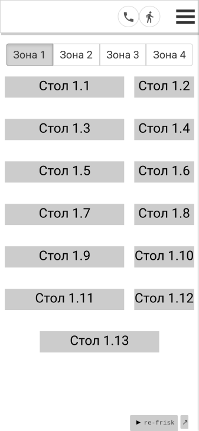

# Waiter interface

A waiter interface for phone browsers

### Using technologies

[Figwheel](https://github.com/bhauman/lein-figwheel), [Reagent](https://github.com/reagent-project/reagent), [Re-frame](https://github.com/day8/re-frame), [Garden](https://github.com/noprompt/garden) etc.

### How does it look?

The app hold information about orders in an restaurant. Each order is one of a few types: 
* a to-go order
* at the table order 
* a order done by a phone

The tables menu have different view modes: list, map etc



Waiter can charge each guest separately. Each sum can be payed by a credit card or by cash, but the application can also calculate the sum one part by cash and another part by a card

 


Dishes can be moved from one order to another order or to a new one. Each item of the order can contain a description


And many other functions...

## Development Mode

### Compile css:

Compile css file once.

```
lein garden once
```

Automatically recompile css file on change.

```
lein garden auto
```

CSS also gets automatically built when running `lein build` and recompiled on change with `lein dev`.

### Run application:

```
lein dev
```

Figwheel will automatically push cljs changes to the browser.

Wait a bit, then browse to [http://localhost:3449](http://localhost:3449).

## Production Build

```
lein clean
lein uberjar
```

That should compile the clojurescript code first, and then create the standalone jar.

When you run the jar you can set the port the ring server will use by setting the environment variable PORT.
If it's not set, it will run on port 3000 by default.

To compile clojurescript to javascript:

```
lein build
```